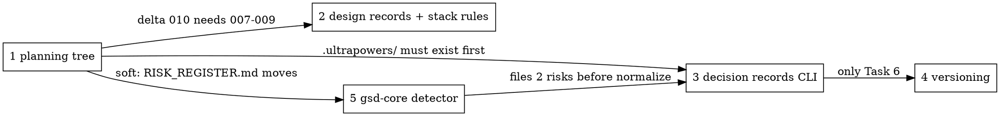

# Execution order for the 2026-07-28 planning overhaul

Five plans, written 2026-07-28, none executed. This document says what may run at the same time
and what may not, and why.

**The dependency graph is derived from files, not from topics.** Two plans that sound related but
never open the same file can run in parallel; two plans that sound unrelated but both rewrite
`RISK_REGISTER.md` cannot.

> **This file relocates itself.** Plan 1 Task 11 moves `docs/superpowers/` to
> `.ultrapowers/archive/`. After that this document lives at
> `.ultrapowers/archive/plans/2026-07-28-EXECUTION-ORDER.md`, together with every plan it names.

## The plans

| # | File | Tasks | Repositories touched |
|---|---|---|---|
| 1 | `2026-07-28-ultrapowers-planning-tree.md` | 12 | fork + bundle |
| 2 | `2026-07-28-design-records-and-stack-rules.md` | 6 | bundle + fork |
| 3 | `2026-07-28-decision-records.md` | 9 | bundle |
| 4 | `2026-07-28-versioning-and-changelog.md` | 7 | bundle |
| 5 | `2026-07-28-gsd-core-detector-and-statusline.md` | 7 | bundle |

"fork" is `D:\6__Work\AI_Projects\ultrapowers` (branch `patch`); "bundle" is
`D:\6__Work\AI_Projects\claude-config` (branch `master`).

## Dependencies

### 1 → 2 (hard)

Plan 2's delta `010-design-records` is authored against the tree deltas `007`–`009` produce. Its
third hunk's context is delta `007`'s rewritten line 111 of `brainstorming/SKILL.md`. Authored
earlier, that context does not exist and `parsePatch` refuses the file. Plan 2 Task 5 Step 1 is
an explicit guard for exactly this — it stops if line 111 still says `docs/ultrapowers/specs/`.

Plan 2 Tasks 1–4 do **not** depend on plan 1. Only Tasks 5–6 do.

### 1 → 3 (hard, and easy to miss)

`resolveRecordPaths(root)` returns `.ultrapowers/adr/` and `.ultrapowers/GLOSSARY.md` **when
`.ultrapowers/` exists**, and the repository root otherwise. Plan 3 Task 8 creates three ADRs and
the glossary through that resolver.

Run plan 3 first and those files land at the repository root — and nothing in plan 1 ever moves
them, because plan 1 Task 11 moves only `docs/superpowers/` and `RISK_REGISTER.md`. The result
contradicts the 2026-07-28 ruling that ADRs live at `.ultrapowers/adr/`, and it fails silently:
every lint passes, the paths are just wrong.

### 5 → 3 (ordering, not capability)

Plan 5 Task 2 Step 6 appends two risk entries. Plan 3 Task 4 rewrites the whole register into
four sections. Either order works, but doing plan 5 first means the normaliser covers those two
entries too; the other way round leaves them in the old format immediately after normalisation,
and the nudge hook then fires on the very next commit.

### 3 → 4 (one task only)

Plan 4 Task 6 Step 4 adds a fourth note to `payload/hooks/decision-records-nudge.mjs`, which plan
3 creates. That step is already marked skippable, and plan 4's `lint-versions.mjs` CLI works
without it. Plan 4 Tasks 1–5 and 7 have no dependency on plan 3 at all.

### 1 → 5 (soft)

Plan 5 files two risks into `RISK_REGISTER.md`; plan 1 Task 11 `git mv`s that file. Rename plus
modify is something git resolves, but running plan 1 first removes the question.

## Shared files — the real constraint

| File | Plan 1 | Plan 2 | Plan 3 | Plan 4 | Plan 5 |
|---|---|---|---|---|---|
| `RISK_REGISTER.md` | moves it | — | rewrites it | — | appends to it |
| `payload/hooks/decision-records-nudge.mjs` | — | — | creates | extends (T6) | — |
| `transform/config.json` (fork) | revision → 2 | revision → 3 | — | — | — |
| `payload/hooks/lib/stack-rules-check.mjs` | sweeps one comment line | rewrites | — | — | — |
| `payload/skills/update-changelog/scripts/` | — | `list-workspaces.mjs` | — | five other files | — |
| `setup.mjs` | — | — | — | — | two regions |
| `settings.partial.json` | — | — | appends a hook | — | — |

Everything not listed is disjoint. In particular `payload/bin/lib/` gains files from plans 2, 3
and 5 — different files each time, no contention.

The `stack-rules-check.mjs` row is the subtle one: plan 1 Task 11 Step 2 runs a blanket
substitution of `docs/superpowers/` → `.ultrapowers/archive/` across every tracked file, and that
file carries the string in a comment on line 9. If plan 2 has rewritten the file on a branch, that
one line conflicts. It is a comment, so the resolution is trivial — but it will appear.

## Recommended schedule

### Wave A — plan 1, alone

Nothing else runs. Two reasons, and the second is the one that bites:

1. Three of the four other plans depend on it.
2. **Task 11 moves the plan files themselves.** `scripts/task-brief PLAN_FILE N` resolves a path;
   relocating `docs/superpowers/plans/` while another plan is mid-execution breaks brief
   extraction for that plan's remaining tasks. Extract Task 12's brief before running Task 11 —
   plan 1 says so — and do not have any other plan in flight.

Internally: Tasks 1–8 are fork-only, Tasks 9–12 are bundle-only. That split is a natural
checkpoint, not a parallelisation opportunity — Task 10 needs the `phase-dir` script emitted by
Task 8's build.

### Wave B — plans 2, 4 and 5 in parallel

Three tracks, three worktrees, no shared files:

| Track | Scope | Notes |
|---|---|---|
| 2 | all 6 tasks | the only track touching the fork in this wave |
| 4 | Tasks 1–5 | Task 6 waits for plan 3; Task 7 waits with it |
| 5 | all 7 tasks | the only track touching `setup.mjs` |

Use `ultrapowers:using-git-worktrees` per track. The fork repository has no contention here
because only track 2 opens it.

### Wave C — plan 3, then the tail of plan 4

Sequential:

1. Plan 3, all 9 tasks. Task 4 normalises a register that now already contains plan 5's two
   entries.
2. Plan 4 Task 6, then Task 7.

## Four rules that override the schedule

**Never run two `node setup.mjs` deploys at once.** Plans 2, 3, 4 and 5 each end with a deploy
step against the real `~/.claude`. Concurrent runs race on the same manifest and the same
`settings.json`. For in-wave verification use `CLAUDE_CONFIG_DIR=$(mktemp -d)`; do the real deploy
once, serially, after the wave completes.

**Never hand-edit the fork's `main` branch.** It is generated. Plans 1 and 2 both rebuild it with
`node transform/build-cli.mjs commit`, and `drift` is the check that it still matches
`original + patch`.

**Delta numbers are authoring order, not spec names.** `007-planning-tree`, `008-sdd-summary`,
`009-agent-first`, `010-design-records`. The build applies them in filename order onto one tree,
so a delta must match what its predecessors produced. The specs' own `007`/`008` names are
superseded and the spec files say so.

**Plan 1 Task 12 Step 4 hands the user an edit no task may make.** `~/.claude/CLAUDE.md` is
`CURATED:NOEDIT` and hook-blocked. Report it; do not work around the hook.

## If only one plan runs

Plan 1. It is the only one that unblocks others, and it is the only one whose absence makes
another plan land files in the wrong place silently.

## If plan 1 is not going to run at all

Plans 4 and 5 are unaffected — run them in either order or together.

Plan 2 loses Tasks 5–6 entirely (delta 010 has no tree to write ADR paths into, and its
brainstorming hunks would need re-authoring against the unmodified upstream text). Tasks 1–4
stand on their own and deliver the workspace-aware stack fingerprint.

Plan 3 still works, but `resolveRecordPaths` will resolve to the repository root throughout. That
is a supported configuration — it is the fallback the resolver exists for — but it is not the
layout the 2026-07-28 ruling asked for. Decide that deliberately rather than by omission.
