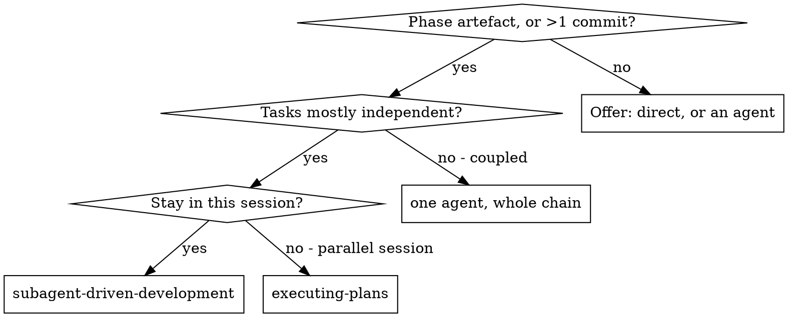

# Agent-first execution, and who writes the phase documents — design

Date: 2026-07-28
Status: approved, not yet planned

## Context

`subagent-driven-development` already states the right principle:

> You delegate tasks to specialized agents with isolated context… This also preserves your own
> context for coordination work.

It then applies that principle **only to code**. The dispatch points are an implementer per task,
a task reviewer after each, and a final whole-branch reviewer. Every document — spec, plan,
summary — is written by the main session.

With the `.ultrapowers/` layout that stops working, and not marginally. `NN-SUMMARY.md` is by
definition a fold of the whole ledger plus every implementer report: measured on this repository,
159 KB, ~41k tokens of input. The main session reaching the end of a phase is already carrying
the plan, the design conversation and all coordination. Asking it to also read 41k tokens of
drafts is not "worse", it is out of budget.

Two entry conditions in the current `When to Use` diagram route to manual execution: no plan, and
tightly-coupled tasks. The second is wrong under an agent-first default — coupling is a reason to
give one agent a chain of tasks, not a reason to abandon delegation.

## The default inverts

**Agent-driven execution is the norm.** The exception is a one-off isolated task, and there the
correct move is to *offer* the choice rather than decide silently.

Boundary, stated so it can be applied without judgement calls in the common cases:

| Situation | Execution |
|---|---|
| Work produces a phase artefact (SPEC/PLAN/SUMMARY/VERIFICATION/REVIEW) | Agent |
| Work spans more than one commit | Agent |
| Tasks are tightly coupled | Agent — **one** agent, given the chain, not one per task |
| Single edit in a known location, no plan needed | Offer: directly, or via an agent |

"Offer" means ask. It does not mean proceed and mention it afterwards.

### Revised routing

The "no plan → manual" exit disappears as an *execution* decision. Absence of a plan is a reason
to write one, not a reason to work without agents.

## Who writes which document

The split is by the nature of the document, not by a blanket rule:

| Artefact | Written by | Why |
|---|---|---|
| `NN-SPEC.md` | main session | `brainstorming` is a dialogue with the human, one question at a time — not delegable |
| `NN-PLAN.md` | main session | `writing-plans` negotiates as it goes |
| `NN-SUMMARY.md` | **subagent** | mechanical fold of ~40k tokens of drafts |
| `NN-VERIFICATION.md` | **subagent** | reads a lot of code, decides little |
| `NN-REVIEW.md` | **subagent** | already the case — `code-reviewer.md` |
| `ROADMAP.md`, `STATE.md` | main session | short edits; "where we are" lives in the coordinator |

Anything requiring the human's answers stays in the main session. Anything requiring bulk reading
goes to an agent.

## New prompts

Following the existing convention of prompt files beside `SKILL.md` (`implementer-prompt.md`,
`task-reviewer-prompt.md`, `re-review-prompt.md`):

- `summary-writer-prompt.md` — input: the ledger and the implementer reports in `sdd/<plan>/`.
  Output: `phases/NN-slug/NN-SUMMARY.md`.
- `verification-prompt.md` — input: the plan and the branch diff. Output:
  `phases/NN-slug/NN-VERIFICATION.md`.

Two constraints that decide whether this actually saves anything:

1. **The agent writes the file and returns one line.** Returning the document's text to the main
   session spends on the way back exactly what delegation saved. The return value is a path and a
   confirmation.
2. **The ledger becomes an input, not just a crash-recovery aid.** Today it is written for its own
   author to re-read after a compaction. Once a different agent consumes it, it needs enough
   structure to be read cold: task, commit range, ruling, deviation.

## Risks

- **Over-delegation on trivia.** A one-line fix routed through an agent costs more than it saves.
  The boundary table above exists to prevent that, and the "offer" branch keeps the human in the
  loop where the call is genuinely close.
- **A summary agent inventing coherence.** Folding drafts invites smoothing over what actually
  happened — particularly parked findings, which are the most valuable and the least flattering
  content. The prompt must require rulings to be carried verbatim, not paraphrased.
- **Coupled chains in one agent lose the per-task review.** Giving one agent several tasks removes
  the review that currently runs after each. The chain still gets a review at its end; that is a
  real reduction in checking, accepted deliberately because the alternative — an agent per task
  with shared state — is worse.

## Out of scope

- Changing `executing-plans`; the parallel-session route is unaffected.
- Parallelising document writers against each other.
- Any change to the implementer/reviewer loop itself.
